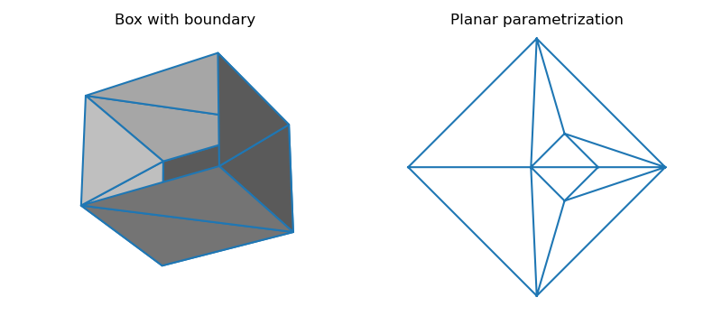

# flattensurface

Planar and spherical surface parametrization in python using [CGAL](https://doc.cgal.org/latest/Surface_mesh_parameterization), [OpenMesh](https://www.graphics.rwth-aachen.de/software/openmesh/) and [SPHARM-MAT](https://www.med.upenn.edu/shenlab/spharm-mat.html).

### Syntax

```python
import flattensurface as flat
vertices = [
    [0, 0, 0],
    [1, 0, 0],
    [1, 1, 0],
    [0, 1, 0],
    [0, 0, 1],
    [1, 0, 1],
    [1, 1, 1],
    [0, 1, 1],
]
triangles = [
    [0, 2, 1],
    [0, 3, 2],
    [0, 7, 3],
    [0, 4, 7],
    [4, 6, 7],
    [4, 5, 6],
    [1, 6, 5],
    [1, 2, 6],
    [3, 6, 2],
    [3, 7, 6],
]
uv = flat.global_parameterization(
    vertices, triangles, method='meanvalue'
)
```



### Implementation

The python package consists in wrapper functions that call executables coded in C++ and linked to binary libraries (SFCGAL, eigen3, OpenMesh, lapack, octave). A few functions from SPHARM-MAT were extracted and slightly modified to make them compatible with octave.

### Installation

On Fedora linux, ```make dependencies``` will install the required libraries. Then, run ```make``` to compile the C++ executables.